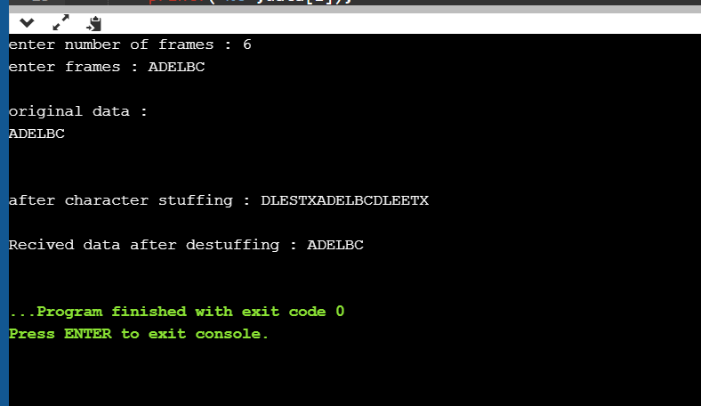

# Experiment 1 - Character Stuffing

## Aim of the Experiment
Implement the data link layer framing method such as Character Stuffing.

### Step by step procedure of experiment
1. Use reserved characters to indicate the start and end of the frame.
2. For instance,use the two-character sequence DLE STX (Data Link Escape,Start of Text) to signal the beginning of a frame,and the sequence DLE ETX(End of Text) to flag the frame's end.
3. Printing the character after Charactr Stuffing.
4.Printing the character without Character Stuffing.

### Output

