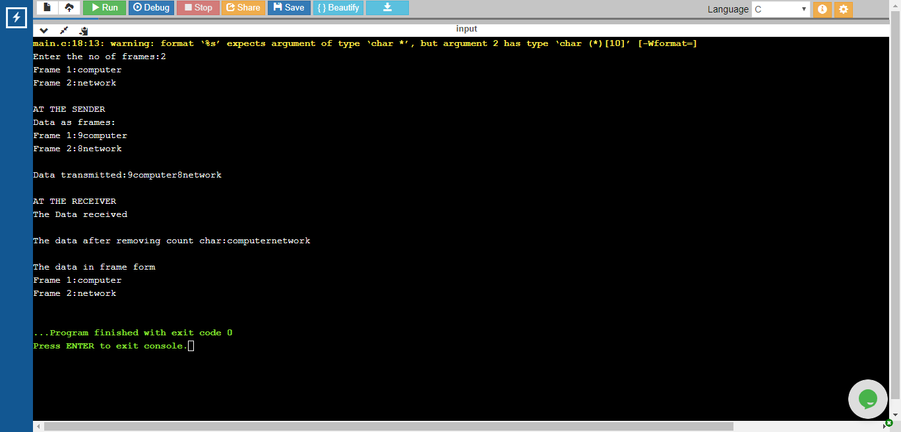

# Experiment 1 - Character Count

## Aim of the Experiment

To implement data link layer framing method charcter count.

### Step by step procedure of experiment

1.Scanning the number of frames and their data.
2.Counting the number of characters in every frame.
3.Printing the character count and frame.
4.Print the frames without count.
5.Printing the data in frames form.

### Output

