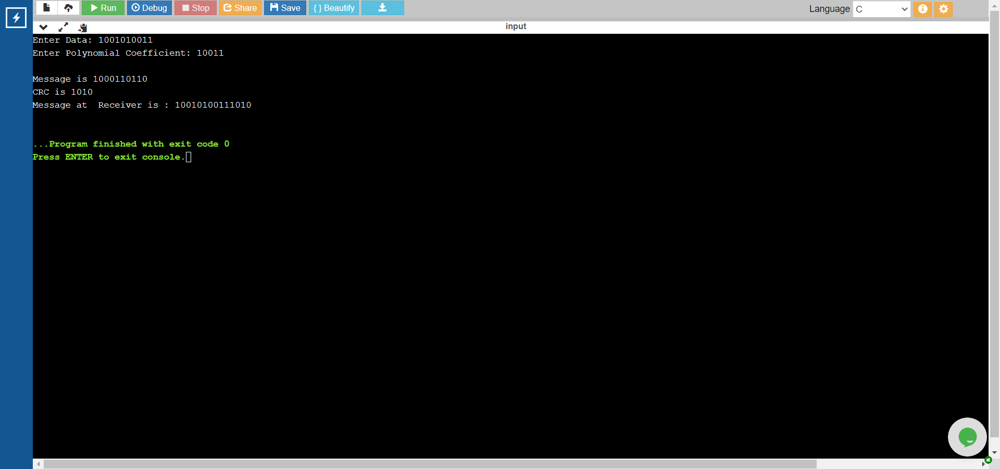

### Experiment 2
## Aim of the Experiment:
A program to compute CRC code for the polynomials CRC-12, CRC-16 and CRC CCIP

# Step by step procedure of experiment
1.Read the input frame 2.Read the polynomial degree coefficient 3.We need to append the zeores based on degree length minus 1 times 4.Store the input into a temp varaiable 5.Perform the XOR operation 6.print the quotient as Message and remainder is the CRC. 7.The data recived at the receiver is combination of Message and CRC. 8.Print the Data at the Receiver side

# Output

