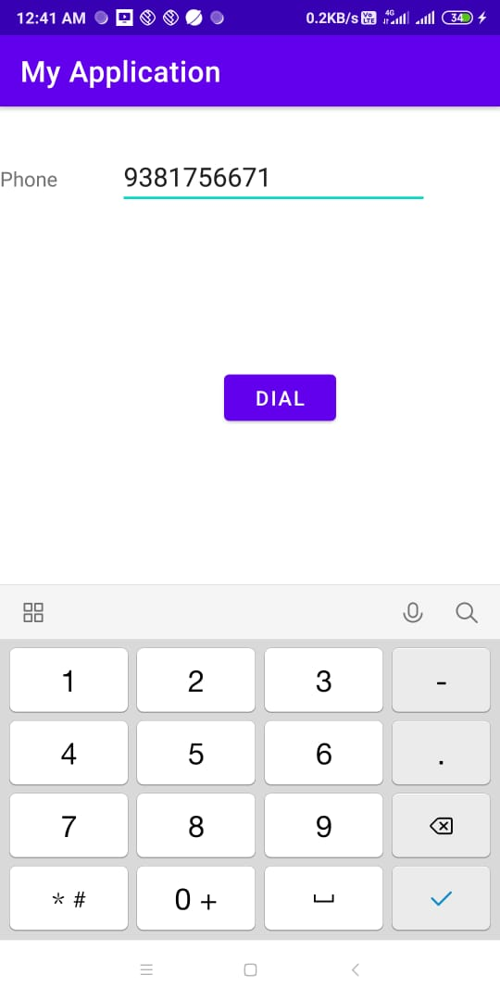
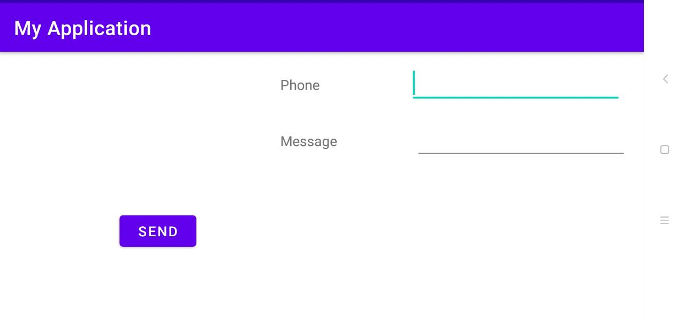
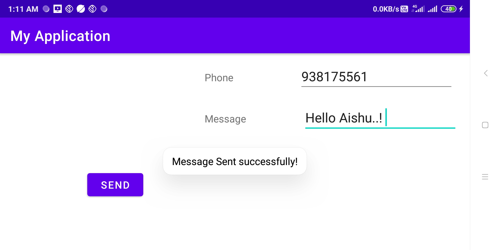

## Experiment 4
An application that uses a menu with 3 options for dialing a number,opening a website and to send an SMS. On selecting an option, the appropriate action should be invoked using intents.

# Output

