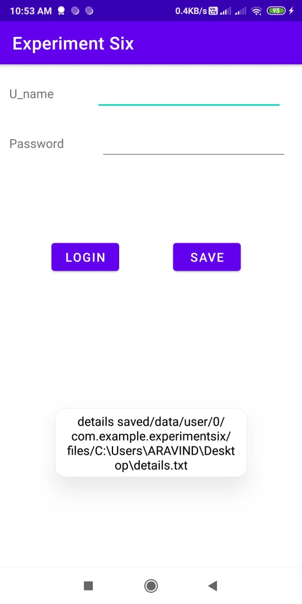
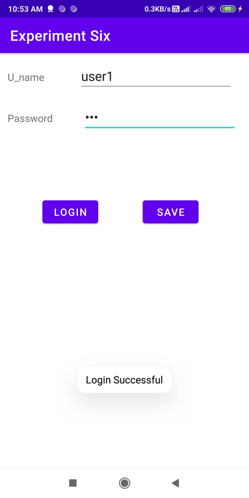

## Experiment 6
Create an application that uses a text file to store user names and passwords (tab separated fields and one record per line). When the user submits a login name and password through a screen, the details should be verified with the text file data and if they match, show a dialog saying that login is successful. Otherwise, show the dialog with Login Failed message.

# Output

