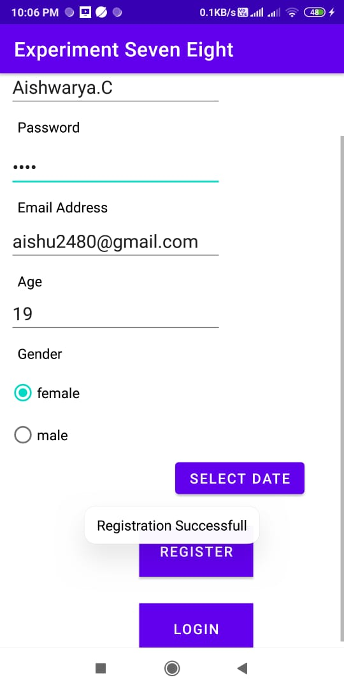

## Experiment 7 & 8
7. Create a user registration application that stores the user details in a database table.
8. Create a database and a user table where the details of login names and passwords are stored. Insert some names and passwords initially. Now the login details entered by the user should be verified with the database and an appropriate dialog should be shown to the user.

# Output

